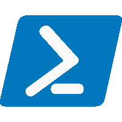
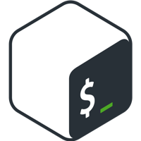
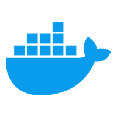
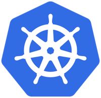

::: {.content-visible when-format="html"}
::: {.grid}
::: {.g-col-8}

# **Stanisław Horna**

Site Reliability Engineer

|  [stanislawhorna@outlook.com](mailto:stanislawhorna@outlook.com)

|  [GitHub](https://github.com/StanislawHorna)

|  [LinkedIn](https://linkedin.com/in/stanislawhorna/)
:::
::: {.content-visible when-format="html"}
::: {.g-col-3}
{ width=200px align=right }
:::
:::

:::
:::

::: {.content-visible when-format="pdf"}
\noindent
\begin{minipage}[c]{0.68\textwidth}
\raggedright
{\huge\bfseries Stanisław Horna}\\[0.6em]
Site Reliability Engineer\\[1.5em]
\faEnvelope\ \href{mailto:stanislawhorna@outlook.com}{stanislawhorna@outlook.com}\\[0.7em]
\faGithub\ \href{https://github.com/StanislawHorna}{GitHub}\\[0.7em]
\faLinkedin\ \href{https://linkedin.com/in/stanislawhorna/}{LinkedIn}
\end{minipage}
\hspace*{\fill}
\begin{minipage}[c]{0.28\textwidth}
\vspace*{2.5em} % ← tweak this to vertically center the photo
\begin{flushright}
\includegraphics[width=4.5cm]{assets/photo.png}
\end{flushright}
\end{minipage}
:::

## Tools & Technologies

\includegraphics[width=3.5em]{assets/logo/python.png}
\includegraphics[width=3.5em]{assets/logo/Powershell_Windows.png}
\includegraphics[width=3.5em]{assets/logo/Go.png}
\includegraphics[width=3.5em]{assets/logo/Terraform.png}
\includegraphics[width=3.5em]{assets/logo/Bash.png}
\includegraphics[width=3.5em]{assets/logo/Vault.png}
\includegraphics[width=3.5em]{assets/logo/PostgreSQL.png}
\includegraphics[width=3.5em]{assets/logo/Docker.png}
\includegraphics[width=3.5em]{assets/logo/K8s.png}
\includegraphics[width=3.5em]{assets/logo/Grafana.png}
\includegraphics[width=3.5em]{assets/logo/Loki.png}
\includegraphics[width=3.5em]{assets/logo/Tempo.png}
\includegraphics[width=3.5em]{assets/logo/Prometheus.png}
\includegraphics[width=3.5em]{assets/logo/OpenTelemetry.png}
\includegraphics[width=3.5em]{assets/logo/Github_Actions.png}

## About [me]{.char-color}

Site Reliability Engineer with 5+ years of experience in IT industry.
I really enjoy creating an application that solves problems I am struggling with,
so every project I build has its purpose.
I am passionate **tech enthusiast** and **developer** building, experimenting, and learning
through hands-on home lab setups and cutting-edge technology projects.

## [Work]{.char-color} Experience

::: {.d-flex .justify-content-between .flex-wrap}

### Site Reliability Engineer \includegraphics[height=1em]{assets/company/Nord_Security.png}  [NordSecurity](https://www.linkedin.com/company/nordsecurity/)

_July 2025 - Present_
:::

I help build and maintain scalable internal systems that empower data analysts, engineers, and scientists.
My focus is on automation, performance, observability, and reliability
to support one of the world’s leading cybersecurity products.

::: {.d-flex .justify-content-between .flex-wrap}

### Site Reliability Engineer \includegraphics[height=1em]{assets/company/Relativity.png}  [Relativity](https://www.linkedin.com/company/relativityhq/)

_December 2023 - June 2025_
:::

I am responsible for RelativityOne (e-discovery product) availability monitoring,
which is based on NewRelic Scripted Browser monitor running JavaScript Selenium test
to verify whether core product functionalities are available for end users.

I specialize in designing, developing, and maintaining automated releases and deployment processes
using custom-built GitHub Actions workflows.
My role involves ensuring seamless and efficient deployment processes across all cloud-hosted tenants.
I work with both Python and PowerShell scripts
to programmatically perform operations needed to achieve the goal.
As a result I have implemented Selenium test versioning and the ability to easily upgrade or rollback our availability test on production instances.

::: {.d-flex .justify-content-between .flex-wrap}

### Operations Specialist \includegraphics[height=1em]{assets/company/Bosch.png}  [Bosch](https://www.linkedin.com/company/bosch/)

_August 2023 - November 2023_
:::

I am developing PowerShell automation scripts which are triggered on monitoring host
via Windows Task Scheduler to cover repetitive daily tasks.
Usually automation scripts are integrated with SPLUNK alerting system
to process data generated by PowerShell and notify operations team
about captured issues or coming manual duties.

::: {.d-flex .justify-content-between .flex-wrap}

### Technical Engineer \includegraphics[height=1em]{assets/company/Atos.png}  [Atos](https://www.linkedin.com/company/atos/)

_July 2021 - July 2023_
:::

I am designing and building automations for as many repetitive tasks as possible using PowerShell scripting.
To be able to achieve the goal I have developed many PowerShell modules related to necessary data transformations,
which are required in every report or dataset processed.
I take care of code speed execution, as well as the optimization of my device resource consumption.
Understanding of general concept of multithreading and multiprocessing accordingly with PowerShell available techniques
allowed me to speed up operations done within the script and make a better use of computer resources.
As a result I capable of delivering very complex reports everyday,
on customer’s order, where combining data from different tools is required.

::: {.d-flex .justify-content-between .flex-wrap}

### IT Network Administrator, Freelance

_June 2019 - June 2021_
:::

I design, build and modernize complete IT infrastructure.
I am responsible for both software and hardware in environments up to 50 users.

During my daily work I cover following areas:

- Network physical and logical topology design, configuration and management -
  Cisco hardware as well as virtualized solutions like pfSense routing software
- Active Directory domains design, configuration and management
- Storage and backup solutions design, configuration and management
- Virtualization solutions design, configuration and management mainly based on Microsoft Hyper-V
- Device monitoring and remote access design, configuration and management

## [Projects]{.char-color}

### [**HornaHomeLab**](https://github.com/HornaHomeLab) - GitHub Organization

It's Github organization dedicated mostly for Infrastructure as a Code and automations,
that I'm running in my Lab environment.

- **HomeLab Setup & Networking**: Automating home networks, routers, firewalls, and servers.
- **Virtualization & Containers**: Building and managing virtual machines and container environments like Docker.
- **On-Premise Infrastructure & Automation**: Leveraging self hosted platforms and deploying infrastructure as code.
- **DevOps & CI/CD Pipelines**: Automating software development lifecycle with continuous integration and delivery.
- **Observability & Monitoring**: Developing custom Prometheus exporters, enhancing observability across infrastructures.

### [**Github Statistics**](https://github.com/StanislawHorna/GitHub_Statistics)

**GitHub Action** based automation leveraging **Python**'s matplotlib library to generate Language statistics
for GitHub user authenticated with provided token.
Supports both Light and Dark Github themes, great for extending

### [**Investment**](https://github.com/StanislawHorna/Investment)

The Investment project is a **Python** based, **containerized** tool
designed to automate and streamline the management and analysis of investment portfolios.
At its core, the project provides robust functionality for handling investment configurations and updating fund quotations,
ensuring that financial data is consistently up-to-date and accurate.
Users can quickly configure investments, retrieve and update quotations, and visualize the results on Grafana dashboards.
One application instance can handle many investment owners with multiple investment wallets for each owner.

## [Education]{.char-color}

### Engineer's degree, Information Technology - Software engineering

[_Lodz University of Technology_](https://www.linkedin.com/school/politechnika-lodzka/)

_2021 - 2025_

- 2024/2025 - Scholarship from the Rector of the Lodz University of Technology
- 2023/2024 - Scholarship from the Rector of the Lodz University of Technology

### ICT Technician

_Jan Szczepanik’s Technical School No. 10 in Lodz_

_2017 - 2021_

- European Union scholarship "Professionals in the Lodz province" -
  scholarships for the most talented

## Languages

- English: Fluent
- Polish: Native
